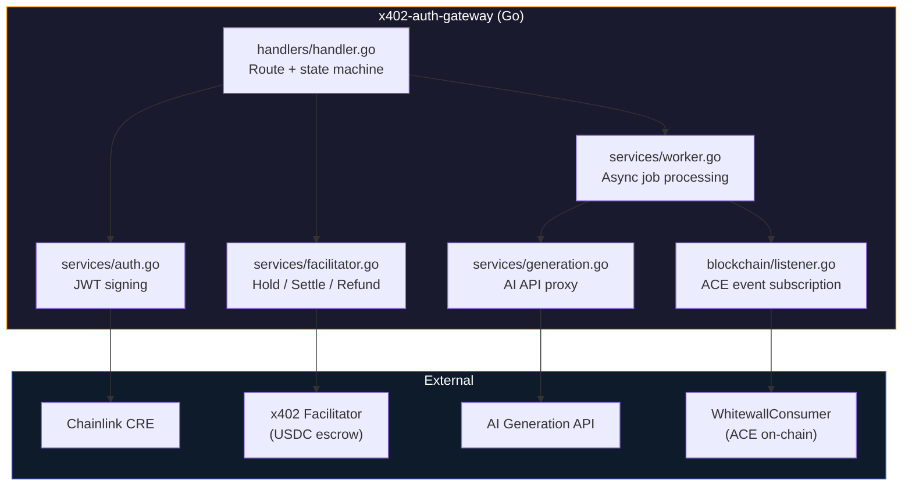

<div align="center">

# x402-auth-gateway

**Pay first, verify on-chain, then access.**

[](https://go.dev)
[](https://www.x402.org)
[](https://docs.chain.link/cre)

> Part of [**Whitewall OS**](https://github.com/hihi-yessir/Verified-Agent-Hub) — on-chain identity and access control for AI agents.

</div>

---

x402 payment-gated proxy for AI agent resource access. An agent requests a resource, gets a 402 payment challenge, submits an EIP-3009 payment signature, and the gateway holds funds while Chainlink CRE verifies the agent's identity on-chain. If ACE approves — settle and serve. If not — refund.

---

## How It Works

```mermaid
sequenceDiagram
    participant Agent as AI Agent
    participant GW as x402 Gateway
    participant F as x402 Facilitator
    participant CRE as CRE Access Workflow
    participant ACE as On-Chain ACE

    Agent->>GW: POST /api/generate
    GW-->>Agent: 402 + X-Payment-Metadata<br/>(price, recipient, nonce)

    Agent->>GW: POST /api/generate<br/>+ X-PAYMENT-SIG (EIP-3009)
    GW->>F: Validate signature + Hold funds

    rect rgb(13,27,42)
        Note over GW,ACE: Verification Phase
        GW->>CRE: Trigger access workflow (JWT)
        CRE->>CRE: Read registries, build report
        CRE->>ACE: writeReport → PolicyEngine
        ACE->>ACE: TieredPolicy (5-8 checks)
    end

    alt AccessGranted
        ACE-->>GW: AccessGranted event
        GW->>GW: Call AI generation API
        GW->>F: Settle payment
        GW-->>Agent: 200 + resource
    else AccessDenied
        ACE-->>GW: AccessDenied / revert
        GW->>F: Refund payment
        GW-->>Agent: 403 + error
    end
```



---

## 3-Step State Machine

| Step | Trigger | What happens |
|:----:|:--------|:-------------|
| **1** | No `X-PAYMENT-SIG` header | Return `402 Payment Required` with payment metadata |
| **2** | Valid `X-PAYMENT-SIG` present | Validate via x402 Facilitator, hold funds, sign JWT, trigger CRE |
| **3** | On-chain `AccessGranted` / `AccessDenied` event | Settle or refund, return resource or error |

---

## API

### `POST /api/generate`

Main endpoint. Behavior depends on headers:

| Header | Present? | Response |
|:-------|:---------|:---------|
| `X-PAYMENT-SIG` | No | `402` + `X-Payment-Metadata` |
| `X-PAYMENT-SIG` | Yes (valid) | `202` → async verification → `200` or `403` |

### `GET /api/status/:jobId`

Poll for async job status (optional).

---

## Architecture



---

## Project Structure

```
x402-auth-gateway/
├── cmd/
│   └── server/
│       └── main.go              # Entrypoint
├── internal/
│   ├── handlers/
│   │   └── handler.go           # HTTP handler + 3-step state machine
│   ├── services/
│   │   ├── auth.go              # JWT signing for CRE
│   │   ├── facilitator.go       # x402 hold / settle / refund
│   │   ├── generation.go        # AI API proxy
│   │   ├── healthcheck.go       # Health endpoint
│   │   ├── pending.go           # Pending job store
│   │   └── worker.go            # Background job processor
│   └── blockchain/
│       └── listener.go          # ACE event listener (go-ethereum)
├── test-agent/                  # Test agent for local dev
├── go.mod
└── go.sum
```

---

## Setup

```bash
# Build
go build -o gateway ./cmd/server

# Run
./gateway
```

### Environment Variables

```bash
PRIVATE_KEY=...                  # Gateway JWT signing key
RPC_URL=...                      # Base Sepolia RPC
CONSUMER_ADDRESS=0x9670cc85...   # WhitewallConsumer (ACE events)
FACILITATOR_URL=...              # x402 Facilitator endpoint
AI_API_URL=...                   # Downstream AI generation API
```

---

## Related Repos

| Repository | Role |
|:-----------|:-----|
| [**Verified-Agent-Hub**](https://github.com/hihi-yessir/Verified-Agent-Hub) | Smart contracts, ACE policies, validators, SDK |
| [**whitewall-cre**](https://github.com/hihi-yessir/whitewall-cre) | CRE workflows (triggered by this gateway) |
| [**whitewall**](https://github.com/hihi-yessir/whitewall) | Demo frontend |
